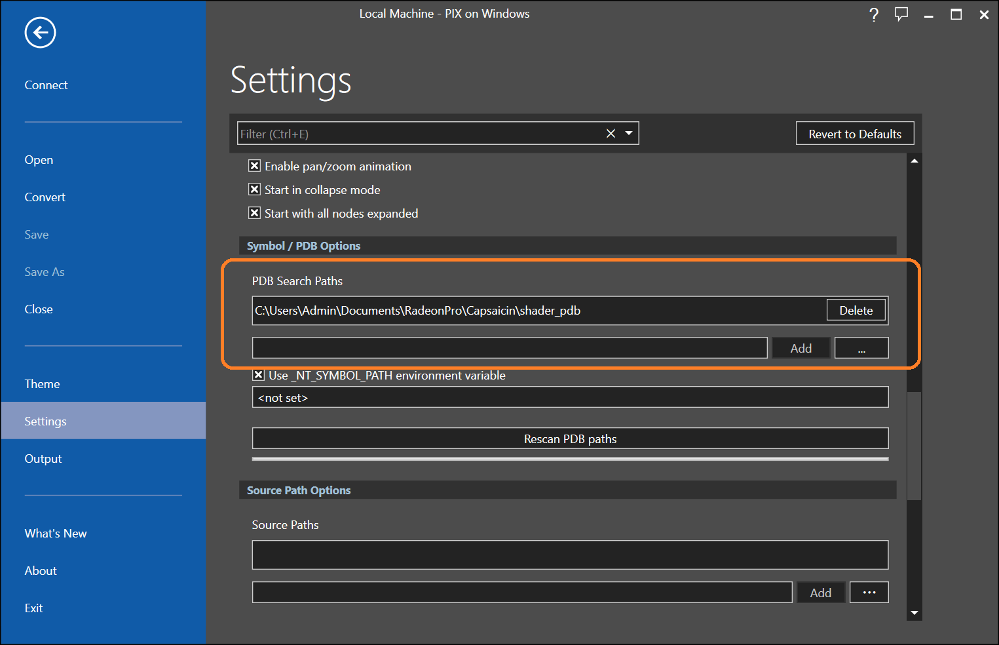
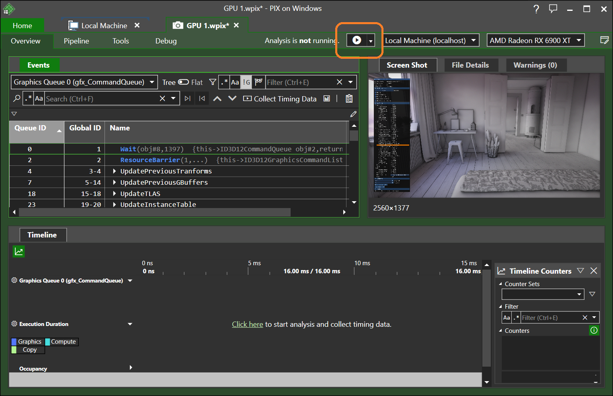
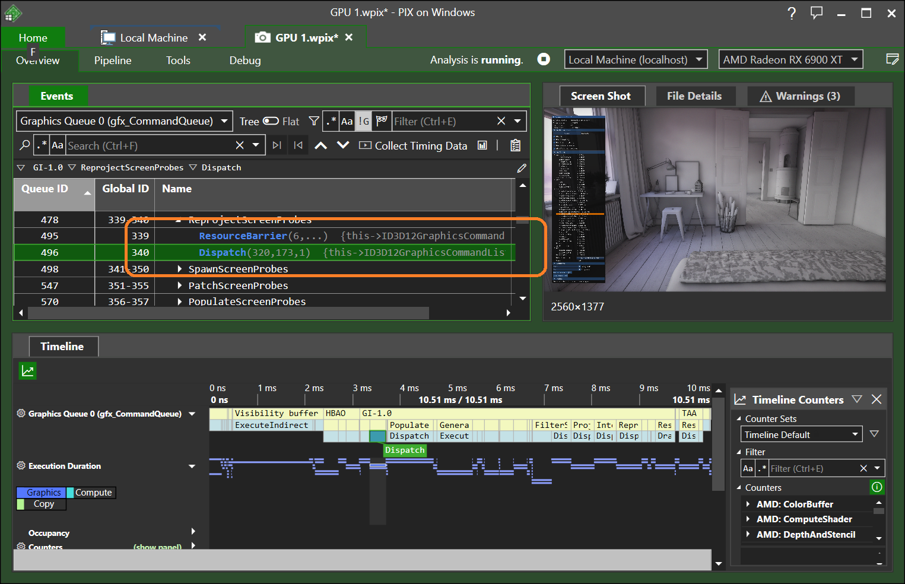
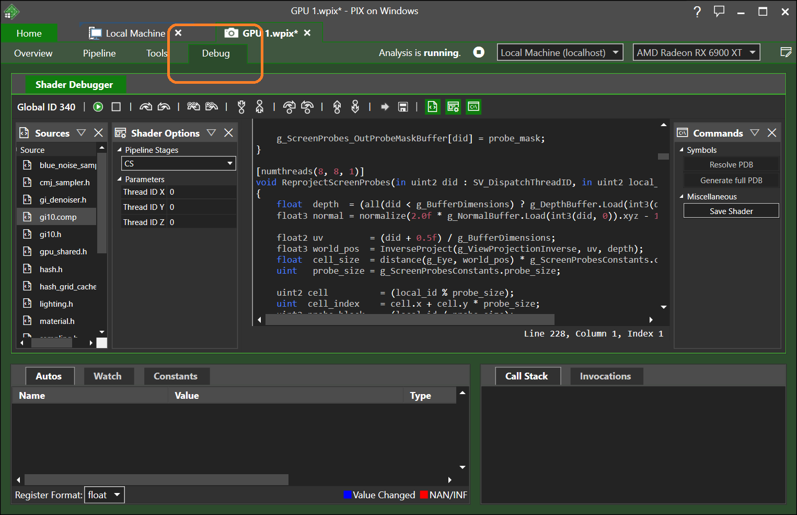

#### [Index](../index.md) | Development

-----------------------

# Shader Debugging

Shader level debugging can be enabled and used through [Pix](https://devblogs.microsoft.com/pix/download/)

Simply add the `kGfxCreateContextFlag_EnableShaderDebugging` upon creating the `gfx` context (This is done automatically in `Debug` builds of the default applications)

```
contextGFX = gfxCreateContext(
	window, kGfxCreateContextFlag_EnableStablePowerState
#if _DEBUG
	| kGfxCreateContextFlag_EnableDebugLayer | kGfxCreateContextFlag_EnableShaderDebugging
#endif
    );
```

Then, in Pix, go to `Home -> Settings -> Symbol / PDB Options` and add the `shader_pdb` directory to the list of PDB search paths:



Finally, perform a Pix capture as normal and start the analysis:



Pick the pass that you want to debug in the `Events` view:



And go to the `Debug` tab to start debugging:



You should be able to insert breakpoints, step over/in/out, inspect the locals, etc.