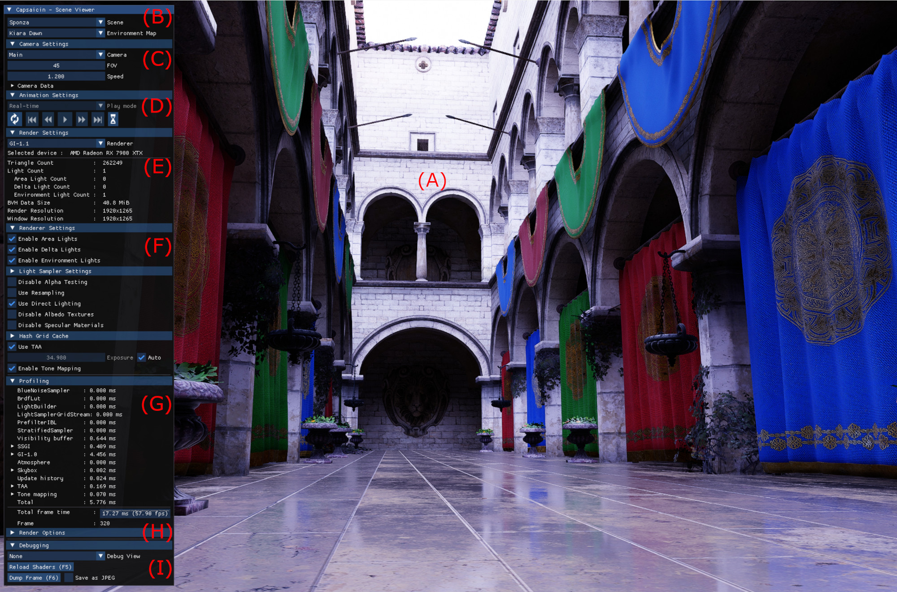
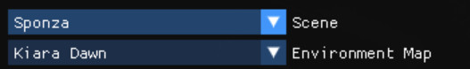
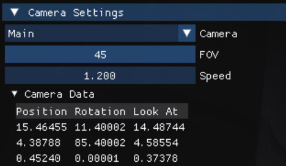
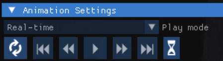
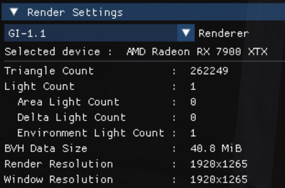
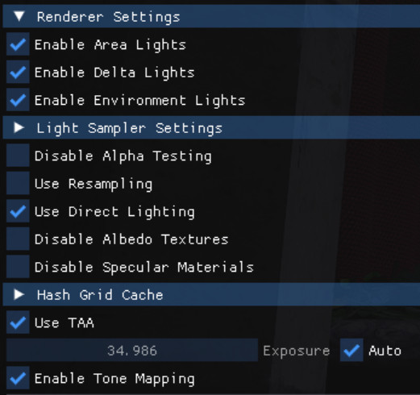
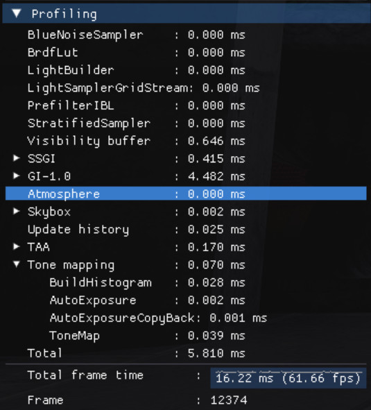
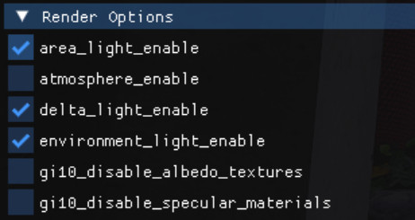
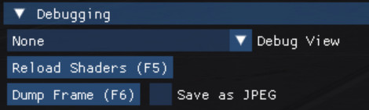

#### [Index](../index.md) | Usage

-----------------------

## Default Application (SceneViewer)

SceneViewer is the default application provided to directly interface with the Capsaicin Rendering Framework. Through SceneViewer a user has access to a multitude of different options and controls.

The default application has a variety of different functionality:
- Select and change scenes from a selection of inbuilt options
- Select and change environment maps from a selection of inbuilt options
- Select and switch between any pre-defined cameras within a scene
- Manually control a user defined camera with real-time keyboard and mouse input
- Select and change the *Renderer* being used to render the current scene
- Get real-time display of current *Render Techniques* and there performance timings
- Change any user exposed *Render Options* that allow for adjusting/changing how each active *Render Technique* functions
- Pause/Resume and skip animations forward and backward
- Pause rendering on a single frame for analysis
- Save current screen capture directly to disk either as JPEG or the pre-tonemapped color values as an HDR image
- Supports custom scene files/environment maps by just dragging & dropping supported files onto the window
- Supports appending scenes to existing ones by holding 'SHIFT' key while dropping new scene files onto the window

### Window Layout

SceneViewer contains 2 main regions. The largest region contains the current rendering results for the currently loaded scene. The other main area is the UI along the left of the window. The UI area contains most of the user controllable options as well as information display for the current scene and rendering setup.

SceneViewer contains the following sections:

- (A) The main rendering display. This area accepts mouse input to move the camera as well as scene file dropping.
- (B) Scene Settings. Contains drop down menus for selecting from internal scenes and environment maps.
- (C) Camera Settings. Contains drop down menu for selecting a camera preset as well as controls for camera parameters.
- (D) Animation Settings. Contains buttons to control animation state such as play/pause, rewind/fast-forward etc.
- (E) Render Settings. Contains drop down for selecting which *Renderer* to use as well as current device/scene/window data.
- (F) Renderer Settings. Contains any user settable options exposed by the current *Renderer*.
- (G) Profiling. Contains timing information for current *Renderer* and its sub components.
- (H) Render Options. Contains internal developer access to all internal state variables.
- (I) Debugging. Contains additional debugging features such as shader reload and image screenshots.

The UI and its various sections are explained further in the next section.

### UI Components

| &nbsp;&nbsp;&nbsp;&nbsp;&nbsp;&nbsp;&nbsp;&nbsp;&nbsp;&nbsp;&nbsp;&nbsp;&nbsp;&nbsp;&nbsp;&nbsp;&nbsp;&nbsp;&nbsp;&nbsp;&nbsp;&nbsp;&nbsp;&nbsp;&nbsp;&nbsp;&nbsp;&nbsp;&nbsp;&nbsp;&nbsp;Section&nbsp;&nbsp;&nbsp;&nbsp;&nbsp;&nbsp;&nbsp;&nbsp;&nbsp;&nbsp;&nbsp;&nbsp;&nbsp;&nbsp;&nbsp;&nbsp;&nbsp;&nbsp;&nbsp;&nbsp;&nbsp;&nbsp;&nbsp;&nbsp;&nbsp;&nbsp;&nbsp;&nbsp;&nbsp;&nbsp;&nbsp; | Description |
| :----:      |    :----:   |
| B : Scene Settings   | This contains the drop down menu of all provided scenes, each one can be run-time changed to by selecting from the drop down.  Underneath is the environment map selection drop down menu for runtime changing a scenes environment lighting. If a scene does not support environment lighting then this drop down menu will not be displayed.  When an external file is loaded then these drop downs will just List "External" as the currently selected scene. If any scenes are appended to the existing one then a "+" symbol will be appended to the name shown in the drop down menu. |
| B : Camera Settings   | This contains a drop down menu of any pre-defined cameras within the currently loaded scene(s), each one can be run-time changed to by selecting from the drop down. This list also contains the "User" camera which is the user controllable camera that can be moved around the scene.  Whenever the user attempts to move the camera via either keyboard or mouse the camera is automatically converted to the user camera with this camera now being located at the current view where movement occurred. This allows for easily going back to a unmodified preset camera via the drop down menu.  As well as camera selection this area also allows for controlling camera parameters such as FOV and movement speed (movement speed only effects user movement and not camera animations).  An expandable "Camera Data" section allows for reading the exact internal variable state for the current camera. |
| C : Animation Settings   | This area contains settings for controlling the current animation state of the loaded scene.  Capsaicin supports 2 playback modes' real-time and fixed frame rate, which can be selected from the first drop down. Real-time mode will update each frame based on elapsed wall clock time, however, fixed frame rate mode will progress at a constant framerate which defaults to 30 frames per second.  Below the drop down is a series of buttons that can be used to control playback state. The first button is the reset button which will reset all animations and the frame index back to zero. The next 5 buttons are used to control animation playback and will only be enabled if the currently loaded scene(s) have any animations.  The second button is used to step back in time by 30 frames.  The next button enables rewinding, if already rewinding then pressing this button again will increase the rewinding speed. The rewind speed can be slowed by 1 step using the fast-forward button or reset to normal playback using the play button. Rewinding can only be used if playback is currently enabled, if animation is currently paused then the rewind button will just jump back in time 1 frame for each button press.  The next button is the play/pause button, this is used to start animation playback or pause it at current position if it had already previously been started. If rewind/fast-forward is in use then this button can also be used to instantly reset playback speed to default.  The next button is fast-forward, this button increases playback speed when pressed and each additional press will further increase the speed. To reduce the speed by a single step then the rewind button can be used or the play button to reset to default speed. If animation is not currently playing then the fast-forward button will instead jump the animation forward by 1 frame.  The next button is the skip forward button, this button will skip animation forward by 30 frames.  The final button allows for pausing the current *Renderer*. This will lock all animation as well as stopping all rendering operations on the current frame. While in this state all animation controls are disabled, however, the play button can be used to render 1 additional frame for each press. This can be used even if the scene(s) don't have any animation as this will not advance animation state but instead just advance rendering to the next frame. |
| D : Render Settings   | The top of this are contains a drop down menu for selecting which *Renderer* to use from all available internal renderers. Selecting a new one will result in a reload of active render components and techniques.  Below this drop down is the list of currently known device and scene properties. These include things such as detected GPU in use, scene complexity, lighting complexity and memory usage. |
| E : Renderer Settings   | This area contains any user visible option and settings that are exposed by the currently in use *Renderer*. Different *Renderers* will have different exposed options and so the contents of this area will change depending on what *Render Techniques* are currently in use.  This area contains a list of any user changeable options that are provided by the currently selected *Renderers* internal *Render Techniques* and *Components*. |
| F : Profiling   | This section contains the current execution costs of each currently executing *Render Techniques* and *Components* and displays them in the order they are executing. Each section may contain multiple smaller subsections that each can be expanded into using the tree structure that displays the profiling data.  Below the profiling tree there is a total frame time display and recent history graph for the running frame rate. This time value may differ from the total listed at the end of the profiling tree as it takes into account presentation delays and not just execution times. When using VSYNC for instance the frame time is delayed until a screen refresh occurs (which caps frame rate at screen refresh rate) which adds extra non-execution time to this value. By default compiling SceneViewer in any any configuration other than Release enables VSYNC. |
| G : Render Options   | This area contains an expandable section containing the full list of every controllable *Render Option* currently registered by all active *Render Techniques* and *Components*. This is for developer debugging only as there is no input checking or validation on any of these values and care should be taken to ensure any changes are valid.  Many of the options listed within this section already have a proper, validated input method within the *Renderer Settings* section.  This section should then only be used for modifying internal values that may not be exposed by other means. |
| H : Debugging   | This section contains useful features for additional debugging. At the top of this area is a drop down menu that allows to visualize any *Shared Textures* or *Debug Views* that are available based on the current *Renderer*. Selecting one of these will change the image displayed on the screen to match the selection from the drop down. Resetting the selection back to "None" will result in the default render output being displayed again.  This section also contains a button to force reload any active shaders from source. This can be used to make modifications to shader code at run-time without having to restart the application or reload any scene assets.  An additional button is provided that can be used to save the current rendered image to disk in either JPEG format (which will contain the tonemapped final display image) or HDR format (which will contain the pre-tonemapped raw floating point image data). |

### Available Controls

The following keyboard and mouse controls are supported:

`Esc` - Exit the program.

`F5` - Reload Shaders.\
`F6` - Take Screenshot and save to disk (files will appear in the `dump` folder)

`W` - Move the user camera forward.\
`A` - Move the user camera left.\
`S` - Move the user camera backward.\
`D` - Move the user camera right.\
`Q` - Move the user camera up.\
`E` - Move the user camera down.\
`Left Mouse (Hold) + Drag` - Rotate user camera.\
`Mouse Wheel` - Change movement speed of user camera with up/down == faster/slower.\
`Mouse Wheel (Horizontal)` - Change Field of View of current camera.

`Space` - Pause/Resume animations (alternatively step forward 1 frame if rendering paused).\
`Left` - Step animation back 1 frame.\
`Right` - Step animation forward 1 frame.\
`Up` - Increase animation playback speed.\
`Down` - Decrease animation playback speed.\
`Ctrl` - Pause/Resume rendering.

### Command Line Options

The following command line parameters are supported:

`-h,--help` -  Print a help message and exit.\
`--version` - Display program version information and exit.\
`--width UINT` - Set window width (Default 1920).\
`--height UINT` - Set window height (Default 1080).\
`--render-scale FLOAT` - Set render resolution scale with respect to window resolution (Default 1.0). This allows for rendering to occur at scales lower or higher than the window resolution and then convert to window dimensions only at presentation time. Examples: Setting scale=2.0 with default window size causes all rendering to internally be performed at 4k.\
`--list-scenes` - List all available scenes and corresponding indexes.\
`--list-environments` - List all available environment maps and corresponding indexes.\
`--list-renderers` - List all available *Renderers* and corresponding indexes.\
`--start-scene-index UINT` - Set scene to load at startup, the index must be one returned by `--list-scenes`.\
`--start-environment-map-index UINT` - Set environment map to load at startup, the index must be one returned by `--list-environments`.\
`--start-renderer-index UINT` - Set *Renderer* to use at startup, the index must be one returned by `--list-renderers`.\
`--start-camera-index UINT` - Set camera index of predefined camera within startup scene to use at startup, the index must be valid for the cmareas listed in the startup scene.\
`--user-camera-position FLOAT FLOAT FLOAT` - Set the initial position of the user camera.\
`--user-camera-lookat FLOAT FLOAT FLOAT` - Set the initial look at position of the user camera.\
`--start-playing` - Start with any animations running (Default is for animation to start paused).\
`--render-options TEXT` - Directly set any additional render options. The render options must match a render option available from the startup renderer. The format for setting render options is `option=value` where `value` must be a vlid value based on the type of the render option `option`. Multiple options can be specified using a single space to separate between them. Example `--render-options tonemap_enable=false light_sampler_type=2`.\
`--save-as-jpeg` - Set any image saves to use JPEG instead of the default HDR.\
`--benchmark-mode` - Enable benchmarking mode. Benchmarking mode will block all user input and only execute for a set number of frames running in fixed frame rate mode. After the specified number frames have elapsed the program will save the final rendered image of the last frame to disk as well as profiling information collected over the program run before exiting automatically.\
`--benchmark-frames UINT` - Set the number of frames to render during benchmark mode before it exists (Needs: --benchmark-mode).\
`--benchmark-first-frame UINT` - Set the first frame to start saving images from (Default just the last frame) (Needs: --benchmark-mode). Benchmark mode normally only saves the last frame but with this a sequence of frames can be saved which can be used to generate animated sequences.\
`--benchmark-suffix TEXT` - Add a text suffix to any saved filenames generated during benchmark mode (Needs: --benchmark-mode). This allows for differentiating the output of different benchmark runs with different parameters.
